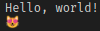
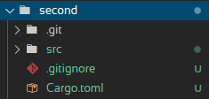
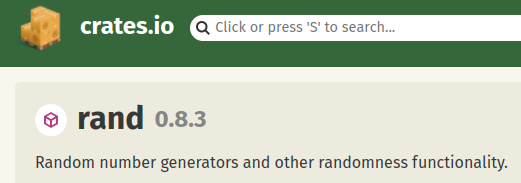
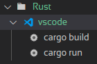
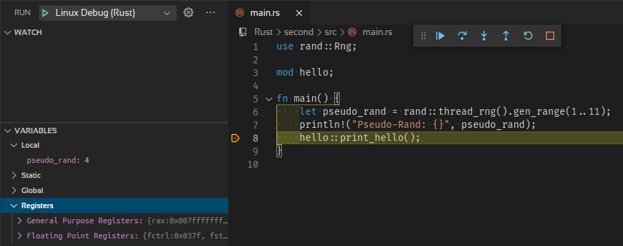

# Rust GOTO

Simple Rust kickoff

Rust is a general-purpose, multi-paradigm, compiled programming language with a static, strong type system. Sponsored by Mozilla Research.

## Installing Rust on Arch-Linux

There are two choices for a rust installation:
- Native
- Rustup

I am using the native solution here, even so VSCode is pretty useless without Rustup (no intelli sense).

`sudo pacman -S rust`  
Total Installed Size:  567.68 MiB  

## VSCode integration

rustup only:
    ext install rust-lang.rust

Enable for workspace only suggested.

## Hello World

```rust
fn main() {
    println!("Hello, world!");
}
```

compile:  
`rustc first.rs`  

`./first`  



## Cargo

Cargo is Rust’s build system and package manager.  

`cargo --version`  
    cargo 1.50.0

A package is called crate.

`cargo --help`

    ...
    install     Install a Rust binary. Default location is $HOME/.cargo/bin
    uninstall   Uninstall a Rust binary
    ...


`cargo update`

## Projects

`cargo new $name`

`cargo second`



[TOML](https://toml.io/) (Tom’s Obvious, Minimal Language) format.

`cargo check` c  
`cargo build` b  
`cargo build --release`  
`cargo run` r  

`cargo --list`  

`cargo fetch`  

## Dependencies

```text
[dependencies]
rand = "0.8.3"
```



https://crates.io/

https://docs.rs/rand/0.8.3/rand/

Cargo.lock File

cargo install rand


## use the dependency

```rust
use rand::Rng;

    const pseudo_rand = rand::thread_rng().gen_range(1..11);
    println!("Pseudo-Rand: {}", pseudo_rand);
```

## Modules

```rust
// main.rs
mod hello;

fn main() {
    hello::print_hello();
}
```

```rust
// hello.rs
pub fn print_hello() {
    println!("Hello, world!");
}
```

    .vscode/tasks.json




    .vscode/launch.json



## Comments

// line comment  
/* block comment */  

    doc comments
///  
/**  */  

<https://doc.rust-lang.org/reference/comments.html>

## Variables

**by default variables are immutable**

```rust
let x = 5;
x = 6; // error

let mut x
```

Shadow copy

```rust
let x = 5;
let x = 6;
```

## Constants

Can be declared in any scope and **not** be computed at runtime!

```rust
const MAX_POINTS: u32 = 100_000;
```

The type of the value must be defined. 

## Types

## Scalars

four primary scalar types: 
- integers
- floating-point numbers
- Booleans
- characters

## Integer Literals


    Decimal         98_222
    Hex             0xff
    Octal           0o77
    Binary          0b1111_0000
    Byte (u8 only)  b'A'

## Floats

```rust
let x = 2.0; // f64

let y: f32 = 3.0; // f32
```

## Booleans

let f: bool = false;

## Characters

`char` type is four bytes in size and represents a Unicode Scalar Value

## Tuples

```rust
let tup: (i32, f64, u8) = (500, 6.4, 1);
let tup = (500, 6.4, 1);
let (x, y, z) = tup;
```

## Arrays

```rust
let a = [1, 2, 3, 4, 5];
let months = ["January", "February"];
```

## Functions

```rust
// params (input)
fn foo(x: i32)

// return values | results ( output)
fn five() -> i32 {
    5
}

fn plus_one(x: i32) -> i32 {
    x + 1
}
```
## Control Flow

```rust
let number = 3;

if number < 5 {
    println!("condition was true");
} else {
    println!("condition was false");
}

let condition = true;
let number = if condition { 5 } else { 6 };

    loop {
    println!("again!");
}

let mut counter = 0;

let result = loop {
    counter += 1;

    if counter == 10 {
        break counter * 2;
    }
};

let mut number = 3;

while number != 0 {
    println!("{}!", number);

    number -= 1;
}
```

## References

https://wiki.archlinux.org/index.php/rust

https://www.rust-lang.org/

https://doc.rust-lang.org/book/ch01-00-getting-started.html

https://doc.rust-lang.org/reference/
